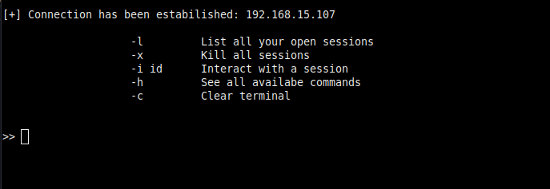
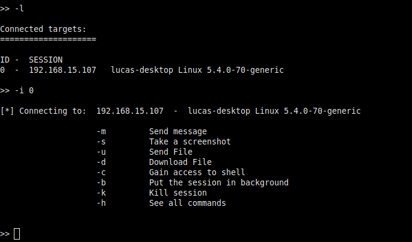
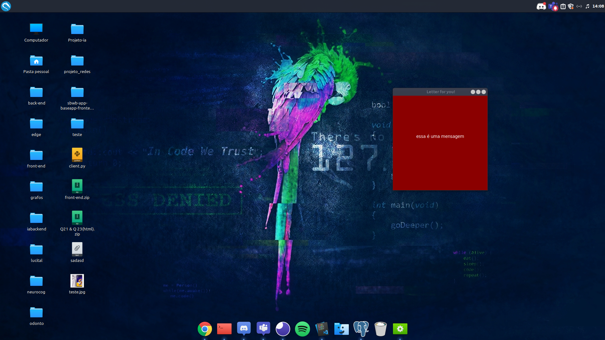
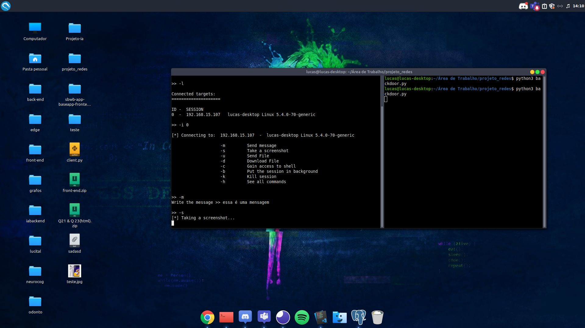
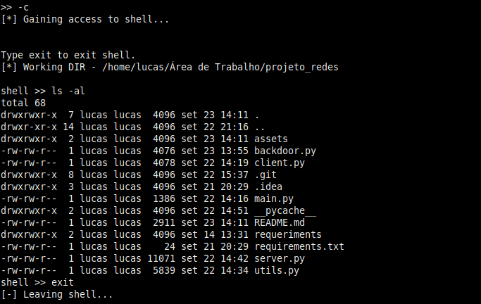

# Projeto de Redes de Computadores

# Alunos: 
## Itallo Patrick Castro Alves
## Lucas Buarque de Araujo Barros
#

<p align="center">
    
</p>

&nbsp;

# Motivação

O projeto foi desenvolvido com o intuito de exemplificar uma forma existente de ataque cibernético e incentivar o estudo na área de segurança informação.

&nbsp;

Obs: Este projeto não incentiva de nenhuma maneira a execução de crimes cibernéticos, utilize-o apenas em ambientes de teste.

&nbsp;

# Como Executar
Para executar o programa, você precisará ter o Python 3 instalado em sua máquina e deverá instalar as bibliotecas externas utilizadas no programa.
Rode o comando abaixo no diretório do projeto para instalar as bibliotecas:

```shellscript
pip install -r requirements.txt
```

Após isso, você poderá executar o programa usando:
```shellscript
python3 main.py
```
&nbsp;

Obs: É necessário fazer a instalação das bibliotecas na máquina alvo, pois o backdoor não será compilado para executável.

&nbsp;

# Instruções

<p align="center">
    
</p>

&nbsp;

## [1] - Gerar backdoor
Nesta opção, você precisará informar o endereço IP da máquina que irá hospedar o servidor e a porta do servidor. Após isso, o programa salvará o arquivo final no diretório do projeto com o nome `backdoor.py`. Depois disso, você poderá enviar o arquivo para a máquina alvo executar e iniciar uma conexão reversa.

&nbsp;
Obs: Em ataques reais, malwares RAT, geralmente, são compilados para arquivos executáveis ou fundidos com outros arquivos para enganar vítimas e terem acesso remoto ao computador das mesmas. Neste trabalho, esse processo não foi feito, pois nele temos apenas a motivação de exemplificar e disseminar informação sobre segurança da ofensiva.

&nbsp;

## [2] - Iniciar o servidor
Esta opção te permitirá iniciar um servidor que irá esperar por conexões com máquinas alvo. Ao selecionar esta opção, o programa te pedirá o endereço IP da máquina que iniciará o servidor (HOST) e sua respectiva porta. Após isso, ele iniciará o servidor e esperará por conexões. O projeto trabalha com multithreads, ou seja, o atacante poderá ter acesso remoto a vários computadores ao mesmo tempo.

&nbsp;

# Após estabelecer conexões
<p align="center"> 
    
</p>

&nbsp;

## Opções

* -l Lista todas as conexões (sessões) abertas com máquinas alvo;
* -x Fecha todas as conexões abertas;
* -i [id] Interage como uma determinada sessão (Acesso à máquina alvo);
* -h Mostra o menu de opções novamente;
* -c Limpa o terminal para uma melhor visualização.

# Interagindo com um alvo
<p align="center"> 
    
</p>

&nbsp;

# -m
Envia uma mensagem para a máquina alvo

Resultado:
<p align="center">
    
</p>

&nbsp;

# -s
Executa uma captura de tela da máquina alvo e salva no computador do atacante.

Resultado:
<p align="center">
    
</p>

# -c 
Dá acesso ao shell de comandos da máquina alvo ao atacante.

Resultado:
<p align="center">
    
</p>

&nbsp;

# Outros comandos

* -u Envia um arquivo do servidor para o cliente (máquina alvo);
* -d O servidor pode fazer o download de um arquivo da máquina alvo;
* -b Põe a sessão que está interagindo atualmente com o atacante em background. Ou seja, ela continuará existindo, mas estará em segundo plano. Sendo assim, o atacante poderá interagir com todas as sessões abertas quando quiser, sem a necessidade de fechá-las;
* -k Fecha a conexão com a vítima;
* -h Mostra o menu de opções;