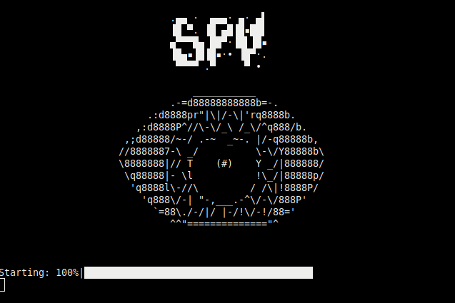
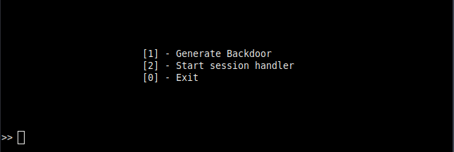

# Projeto de Redes de Computadores

# Alunos: 
## Itallo Patrick Castro Alves
## Lucas Buarque de Araujo Barros
#



&nbsp;

# Motivação

O projeto foi desenvolvido com o intuito de exemplificar uma forma existente de ataque cibernético e incentivar o estudo na área de segurança informação.

&nbsp;

Obs: Este projeto não incentiva de nenhuma maneira a execução de crimes cibernéticos, utilize-o apenas em ambientes de teste.


# Como Executar
Para executar o programa, você precisará ter o Python 3 instalado em sua máquina e deverá instalar as bibliotecas externas utilizadas no programa.
Rode o comando abaixo no diretório do projeto para instalar as bibliotecas:

```shellscript
pip install -r requirements.txt
```

Após isso, você poderá executar o programa usando:
```shellscript
python3 main.py
```
&nbsp;

Obs: É necessário fazer a instalação das bibliotecas na máquina alvo, pois o backdoor não será compilado para executável.

# Instruções



&nbsp;

## [1] - Gerar backdoor
Nesta opção, você precisará informar o endereço IP da máquina que irá hospedar o servidor e a porta do servidor. Após isso, o programa salvará o arquivo final no diretório do projeto com o nome `backdoor.py`. Depois disso, você poderá enviar o arquivo para a máquina alvo executar e iniciar uma conexão reversa.

&nbsp;
Obs: Em ataques reais, malwares RAT, geralmente, são compilados para arquivos executáveis ou fundidos com outros arquivos para enganar vítimas e terem acesso remoto ao computador das mesmas. Neste trabalho, esse processo não foi feito, pois nele temos apenas a motivação de exemplificar e disseminar informação sobre segurança da ofensiva.

&nbsp;

## [2] - Iniciar o servidor
Esta opção te permitirá iniciar um servidor que irá esperar por conexões com máquinas alvo. Ao selecionar esta opção, o programa te pedirá o endereço IP da máquina que iniciará o servidor (HOST) e sua respectiva porta. Após isso, ele iniciará o servidor e esperará por conexões.
